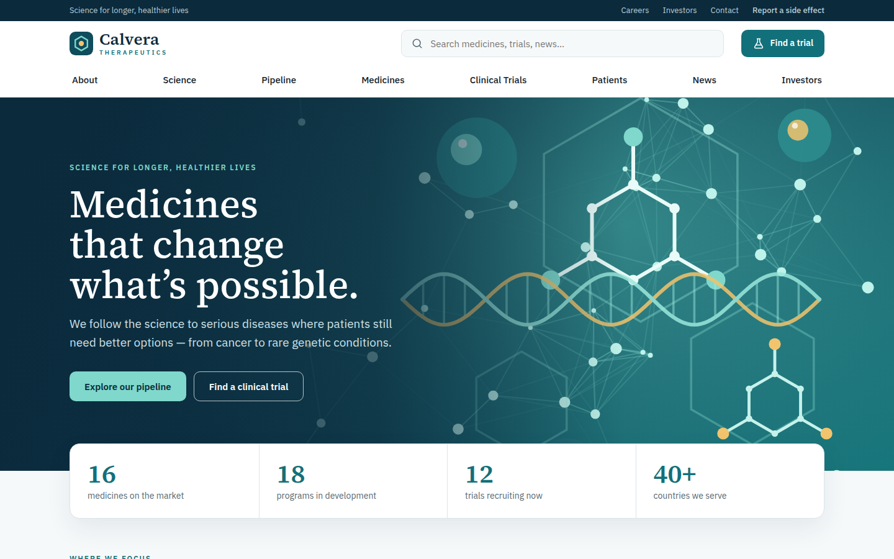
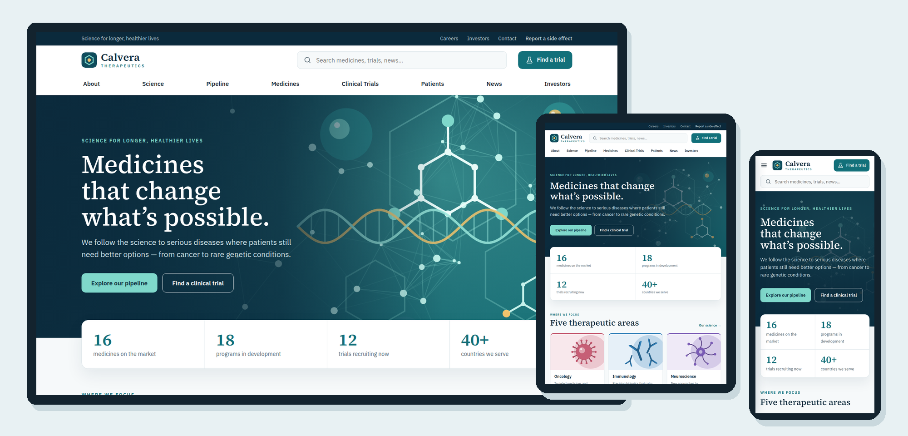

# Calvera Therapeutics — SkyNet Pharmaceutical Website Template

A responsive pharmaceutical company website template for **ASP.NET Core (.NET 10)**, built on the **SkyNet Framework**.
Free and open source. **100% AI-driven coding — built by Claude.**

[](https://dotnet.microsoft.com/)
[](https://www.nuget.org/packages/TheSkyLite.SkyNet)
[](LICENSE)
[](#100-ai-driven-coding)



> **Fictional company.** Calvera Therapeutics, its medicines, clinical trials, people, ticker and financial data are invented for demonstration. Nothing in this template is medical or investment advice.

---

## Features

- **11 pages:** Home, About, Science, Pipeline, Medicines, Clinical Trials, Patients, News, Investors, Careers, Contact
- **Responsive:** desktop, tablet and phone layouts
  - Desktop: hover mega menus with two link columns and a promo tile
  - Tablet: scrolling menu bar, two- and three-column grids
  - Phone: slide-in menu with tap-to-expand sections
- **Site search:** live suggestions across medicines, pipeline, trials and news, served by the page's C# method
- **Pipeline board:** programs by therapeutic area and phase, filtered in place
- **Clinical trial finder:** search by condition or study ID, filter by phase, status, area and location; study details load on demand
- **Newsroom:** category chips, year filter and *Load more*
- **Investors:** share price chart (6M / 1Y / 5Y) drawn as SVG on the server, key stats, quarterly results, events, filings and FAQ
- **Careers:** open positions filtered by department and location
- **Contact:** form with server-side validation (demo — nothing is sent), side-effect reporting and medical information panels
- **Deep links:** `Pipeline?area=oncology`, `Pipeline?phase=p3`, `Trials?status=recruiting`, `Trials?q=CT-2026-101`, `News?cat=rd`, `Products?area=rare`, `Careers?dept=rd`
- **All artwork is SVG:** hero, 10 banners, 5 therapeutic-area illustrations, 16 product packs, logo — no external images
- **No front-end build:** plain HTML, CSS and vanilla JavaScript; no npm, no bundler, no SPA framework



---

## Getting started

**Requirements:** .NET 10 SDK and Visual Studio (or any editor with the `dotnet` CLI).

```bash
git clone <this-repository-url>
cd <repository-folder>
dotnet run
```

Or open `Pharma.csproj` in Visual Studio and press **F5**.
The SkyNet package (`TheSkyLite.SkyNet`) restores automatically from NuGet.
The app opens on **Home** — the startup page set in `appConfig/application.cfg`.

---

## Project structure

```
Pharma/
├── appConfig/application.cfg     app settings and folder names (startup page = Home)
├── codes/                        page classes (C#)
│   ├── Models/PharmaModel.cs     data DTOs
│   ├── Home.cs  Pipeline.cs  Trials.cs  ...
├── htmls/                        page markup
├── scripts/                      page JavaScript
├── styles/                       page CSS
├── data/site.json                areas, medicines, pipeline, trials, news, results, people, jobs, prices
├── images/
│   ├── banners/                  page banners (SVG)
│   ├── areas/                    therapeutic-area illustrations (SVG)
│   ├── products/                 product pack illustrations (SVG)
│   ├── hero.svg
│   └── logo.svg
├── Properties/launchSettings.json   hot reload off
└── Program.cs
```

### One page = four files, one name

| File | Holds |
|---|---|
| `codes/Trials.cs` | the page class (`: WebPage`) and its server methods |
| `htmls/Trials.html` | markup with `{plhd_*}` placeholders |
| `scripts/Trials.js` | one IIFE namespace, `TrialsJs` |
| `styles/Trials.css` | styles, every class prefixed (`ct-`) |

Each page is self-contained: its own CSS prefix, its own script and its own C# methods.

---

## SkyNet in action

The browser calls a C# method; the method returns an `ApiResponse`; only those parts of the page change.
One request can return one or more instructions, applied at the same time.

```js
// scripts/Trials.js
$ApiRequest('Trials/Detail', JSON.stringify([{ key: 'id', vlu: id }]));
```

```csharp
// codes/Trials.cs
public async Task<ApiResponse> Detail()
{
    ApiResponse response = new ApiResponse();
    ...
    response.SetElementContents("ct-d-" + t.Id, sb.ToString());
    response.ExecuteScript("TrialsJs.opened('" + t.Id + "');");
    return response;
}
```

| Page | Request | Response |
|---|---|---|
| every page | `Search` | suggestion list + open it |
| Pipeline | `Filter` | board + count |
| Medicines | `Filter` | grid + count |
| Clinical Trials | `Filter`, `Detail` | list + count; study details + open |
| News | `Filter`, `More` | grid + count + load-more button |
| Investors | `Chart` | SVG chart for 6M / 1Y / 5Y |
| Careers | `Filter` | job list + count |
| Contact | `Send` | field errors or confirmation + clear form |

Learn more: [SkyNet Developer Guide](https://www.theskylite.com/documents/SkyNet_Developer_Guide.html)

---

## Customize it

- **Content:** edit `data/site.json` — medicines, pipeline programs, trials, news, quarterly results, leaders, offices, jobs, events, filings and weekly share prices
- **Company name:** search and replace `Calvera` in `htmls/` and the page titles in `codes/`
- **Colors and fonts:** change the CSS variables at the top of each page's stylesheet (`--hm-teal`, `--hm-navy`, `--hm-serif`, …)
- **Therapeutic-area colors:** `areas[].color` and `areas[].tint` in `data/site.json`
- **Images:** replace any SVG in `images/` with your own artwork or photos

> Prescribing information links, *Apply* buttons, the contact form and social links are placeholders — connect them to your own systems.
> A real pharmaceutical website also needs regulatory review of all medical content.

---

## 100% AI-driven coding

Every file in this template — C#, HTML, CSS, JavaScript, the SVG artwork and the data — was generated by Claude (Anthropic's AI) from a short instruction, directed and reviewed by the author.
No line was written by hand.

| | |
|---|---|
| Pages | 11 |
| Lines of code | ~12,800 (C#, HTML, CSS, JavaScript) |
| SVG images | 33 |
| Medicines / pipeline programs / trials | 16 / 24 / 30 (fictional) |
| Lines written by hand | 0 |

SkyNet's simple, predictable page model (one class, four files, `$ApiRequest` → `ApiResponse`) is what makes this possible:
the rules are few and consistent, so AI can generate complete, working pages with very few errors.

---

## License

- **This template** (all source files, artwork and data in this repository): [MIT License](LICENSE) — free to use, modify and redistribute, including commercially.
- **SkyNet Framework** (`TheSkyLite.SkyNet` NuGet package): proprietary, free to use including commercial use; see the license included in the package.

---

## Links

- SkyNet Framework: https://www.theskylite.com
- NuGet package: https://www.nuget.org/packages/TheSkyLite.SkyNet
- Beauty storefront template: https://github.com/hkim6000/SkyNet-BeautyWebsite-Asp.net.Core-Full-Source
- SkyNet project template: https://github.com/hkim6000/ASPNETCoreEmpty.SkyNet

© 2026 HC Kim
